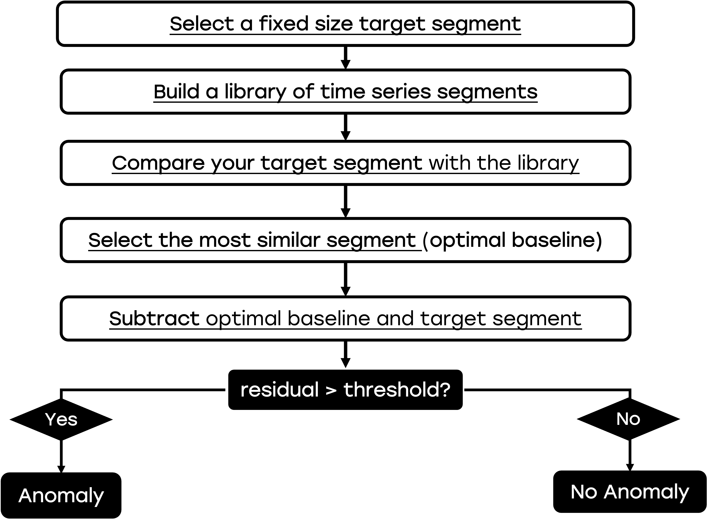

# Simple Anomaly Detection in Time Series via Optimal Baseline Subtraction (OBS)
**Anomaly detection** in time series is used to identify unexpected patterns in your time series. The number of applications of Anomaly Detection in Time Series is huge. In **energy engineering**, a spike in power usage might signal a fault. In **finance**, sudden drops or peaks can indicate major market events. In **mechanical systems**, unusual vibrations may reveal early signs of failure.

## Optimal Baseline Subtraction  

If you have a bank of time series and you want to understand if and in what portion of the time series you have an anomaly, a simple but very efficient metod is called **optimal baseline subtraction (OBS)**. OBS is based on comparing each time series segment to the most similar historical pattern and analyzing the difference to detect unexpected deviations. 

### Optimal Baseline Subtraction Algorithm

The OBS algorithm is the following:

- **Split the time series into individual segments**, where each segment represents a unit of repeated behavior (e.g., a day, a cycle, or a process run).
- **Build a library of historical segments** by collecting all previous segments in the time series bank.
- **For compare it to all others in the library using a similarity metric, such as Mean Absolute Error (MAE).
- **Select the most similar segment** from the library as the optimal baseline.
- **Subtract the baseline from the target segment** to isolate the residual (i.e., the difference).
- **Analyze the residual** to identify large deviations, which are flagged as potential anomalies.

